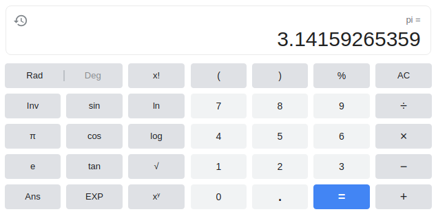
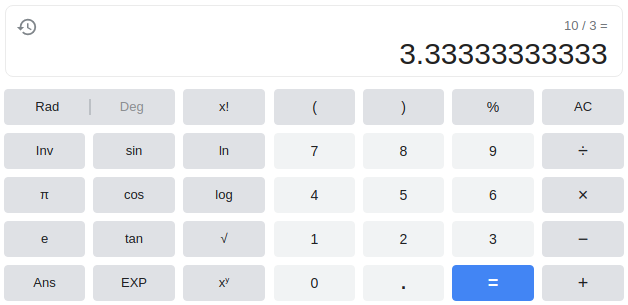
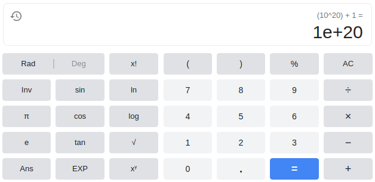
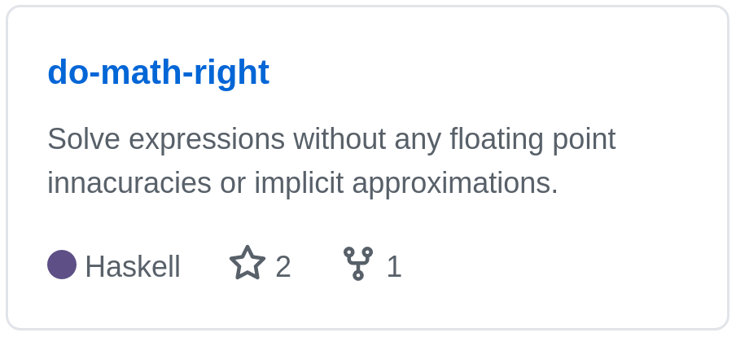
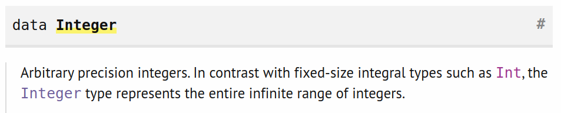
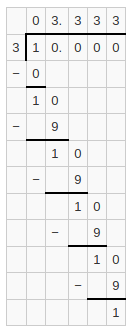

# Calculators are liars

---

# They lie about irrational numbers



---

# They also lie about rational numbers



---

# They even lie about whole numbers



---

This just will not do.

---

# Innovative and revolutionary

---

# Beyond its time

---

# The most advance calculator we've ever created

---



---

# Doing whole numbers right!

```nothing
╔═══════════════╗
║ do-math-right ║
╚═══════════════╝

>  10^20+1
```

---

# Doing whole numbers right!

```nothing
╔═══════════════╗
║ do-math-right ║
╚═══════════════╝

>  10^20+1
do-math-right-exe: src/Operator.hs:(64,30)-(77,18): Non-exhaustive patterns in case

jamie in ~/repos/do-math-right on master● exited 1
```

---

# Doing whole numbers right! (round 2)

```nothing
╔═══════════════╗
║ do-math-right ║
╚═══════════════╝

>  10*10*10*10*10*10*10*10*10*10*10*10*10*10*10*10*10*10*10*10+1
=> 100000000000000000001
```

---

# How it's done

1) By using a superior programming language

1) Using the Integer type



---

# Doing rational numbers right!

```nothing
╔═══════════════╗
║ do-math-right ║
╚═══════════════╝

>  10/3
```

---

# Doing rational numbers right!

```nothing
╔═══════════════╗
║ do-math-right ║
╚═══════════════╝

>  10/3
=> 3.(3)
```

---

# How it's done

1) Store all numbers as fractions of the infinitely large integers `numerator/denominator`

2) Only evaluate decimal values for display purposes, after evaluation



---

# Doing irrational numbers right!

```nothing
╔═══════════════╗
║ do-math-right ║
╚═══════════════╝

>  PI
```

---

# Doing irrational numbers right!

```nothing
╔═══════════════╗
║ do-math-right ║
╚═══════════════╝

>  PI
=> 3.14159 ± 1/100000
```

---

# How it's done

1) Store all irrational numbers with an associated accuracy value
`(approximation, accuracy)`

2) Append the accuracy value as the "plus or minus" value when creating the decimal representation

---

# Doing irrational numbers right!

```nothing
>  PI

create an approximate fraction of pi:

    retrieve an array of the digits in Pi: [3, 1, 3, 1, 5, 9]

    convert that array into an integer: 314159

    create fractional representation: (314159, 10^5)

create the accuracy fraction of pi:

    create fractional representation: (1, 10^5)

create final value: ((314159, 10^5), (1, 10^5))

=> 3.14159 ± 1/100000
```

---

The worlds first calculator

# that isn't a liar

---

# No more floating point innaccuracies

Store infinitely large numbers without losing any information

Perform operations knowing that you'll never lose any accuracy because everything is stored as a fraction

---

# No more implicit approximations

Approximations are always explicit given with the "plus or mins" operator (±).

Perform operations knowing that the calculator is aware of the innaccuracies and will generate new plus or minus values if they change.

---

## https://github.com/Jumbub/do-math-right


